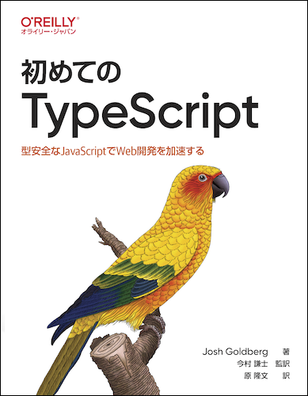

# 「初めての TypeScript」　写経記録

---

---

本リポジトリはオライリー・ジャパン発行書籍『[初めての TypeScript](https://www.amazon.co.jp/dp/4814400365/)』の写経記録です。

README.md ファイルの作成については、[こちら](https://github.com/oreilly-japan/learningtypescript-ja/tree/main)の日本語版サンプルコードを参考にしています。
そのほかのファイルについては、書籍を参考に写経しています。

## 写経元

Josh Goldberg 著
『初めての TypeScript』
オライリー・ジャパン発行
